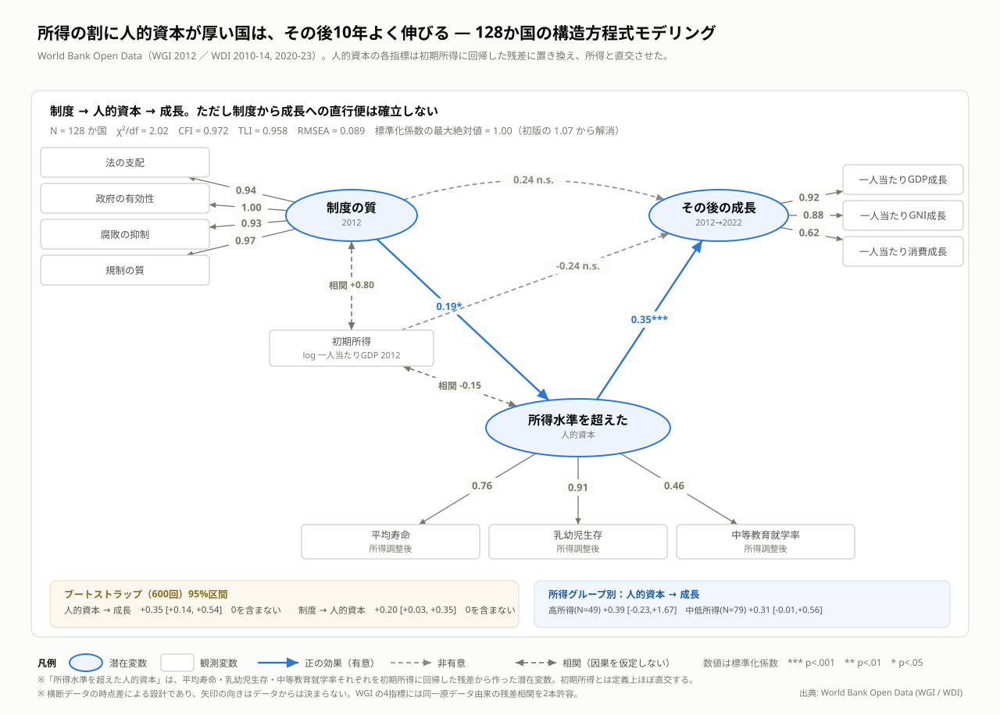
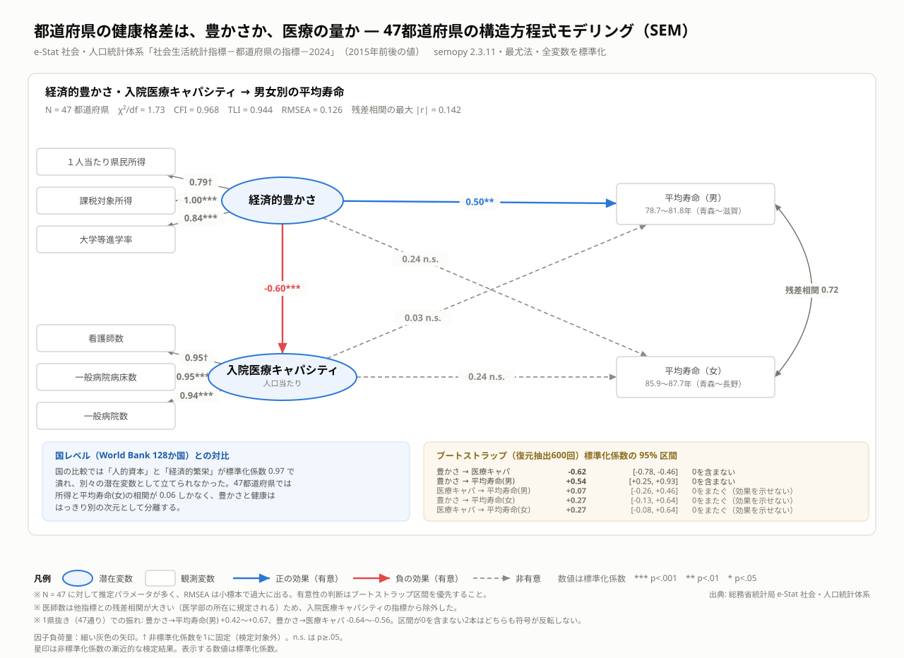
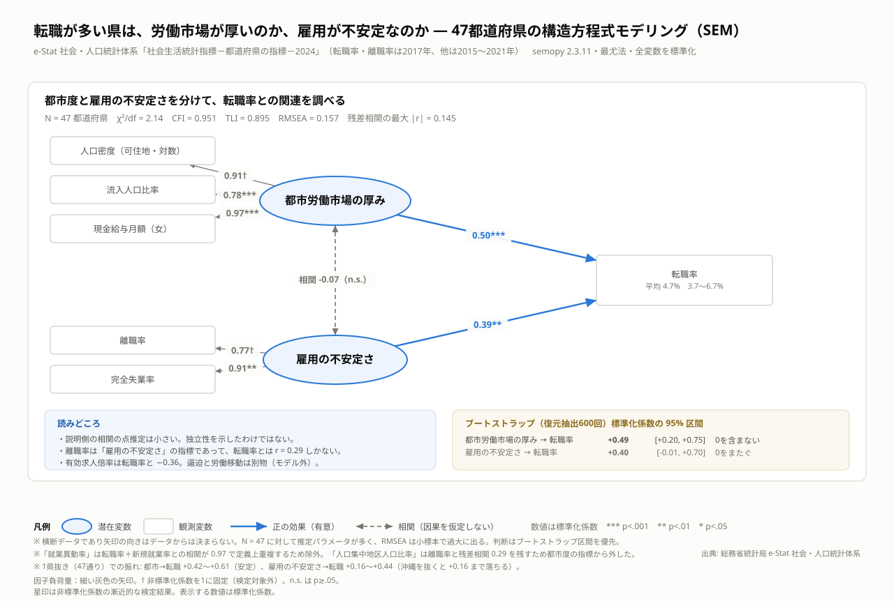
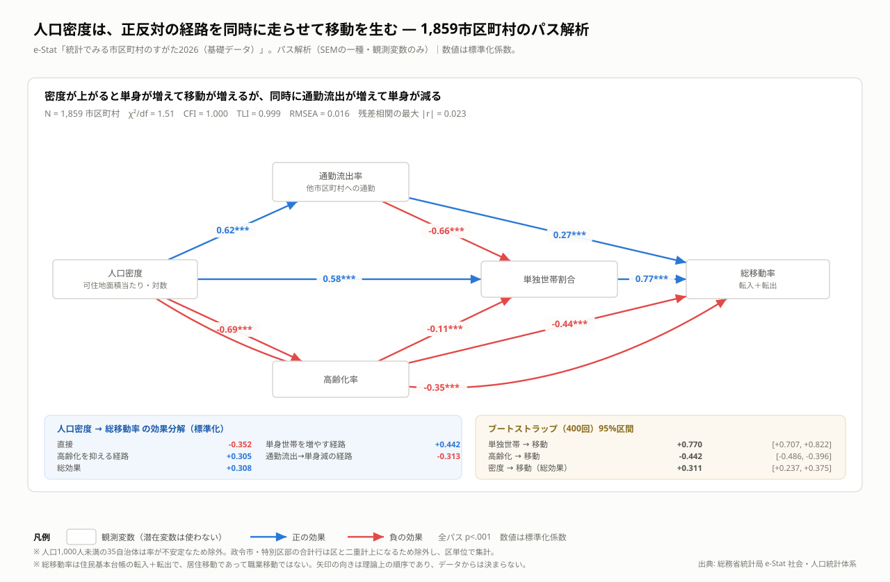
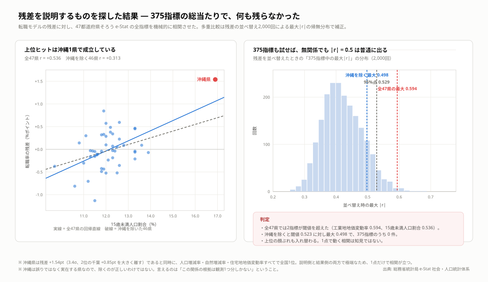
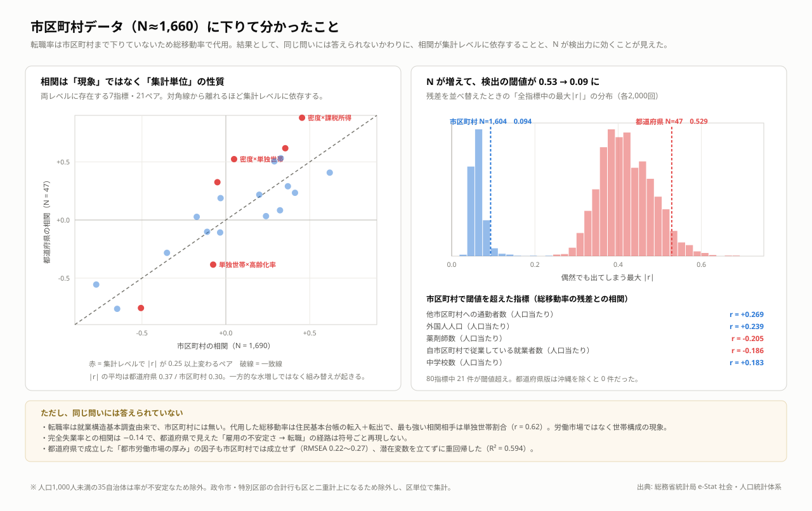

# 公的データによる構造方程式モデリング

**📊 図と結果の目次 → https://yoshiokatsuneo.github.io/open-gov-data-sem-jp/**

World Bank と e-Stat の**公開データだけ**を使い、4つの分析単位（128か国 / 47都道府県 ×2本 / 1,859市区町村）で構造方程式モデリング（SEM）を行った記録。全てAPIキー不要で取得でき、`make all` で48秒で完全再現できる。

このリポジトリの価値は結果そのものより、**「何が確立し、何が確立しなかったか」と「なぜ確立しなかったか」を検証可能な形で残したこと**にある。途中で一度、範囲制限を見落として誤った結論を出しかけ、それを自分で検算して撤回した過程もそのまま残してある。

---

## 目次

- [結果の要約](#結果の要約)
- [4つの分析](#4つの分析)
- [方法論の教訓](#方法論の教訓)
- [再現手順](#再現手順)
- [リポジトリ構成](#リポジトリ構成)
- [データ出典](#データ出典)
- [限界と、次にやるべきこと](#限界と次にやるべきこと)

---

## 結果の要約

### 確立した関係（ブートストラップ95%区間が0を含まない）

| 分析 | パス | 標準化係数 | 95%区間 |
|---|---|---|---|
| 国 (N=128) | 所得水準を超えた人的資本 → その後10年の成長 | **+0.35** | [+0.14, +0.54] |
| 国 (N=128) | 制度の質 → 所得水準を超えた人的資本 | **+0.19** | [+0.03, +0.35] |
| 都道府県 (N=47) | 経済的豊かさ → 入院医療キャパシティ | **−0.62** | [−0.78, −0.46] |
| 都道府県 (N=47) | 経済的豊かさ → 平均寿命（男） | **+0.55** | [+0.25, +0.93] |
| 都道府県 (N=47) | 都市労働市場の厚み → 転職率 | **+0.49** | [+0.20, +0.75] |
| 市区町村 (N=1,859) | 単独世帯割合 → 総移動率 | **+0.77** | [+0.71, +0.82] |
| 市区町村 (N=1,859) | 高齢化率 → 総移動率 | **−0.44** | [−0.49, −0.40] |
| 市区町村 (N=1,859) | 人口密度 → 総移動率（総効果） | **+0.31** | [+0.24, +0.38] |

### 確立しなかった関係（区間が0をまたぐ）

| 分析 | パス | 係数 | 95%区間 |
|---|---|---|---|
| 国 | 制度の質 → 成長（直接） | +0.24 | [−0.04, +0.49] |
| 国 | 初期所得 → 成長（条件付き収束） | −0.26 | [−0.53, +0.05] |
| 都道府県 | 経済的豊かさ → 平均寿命（女） | +0.27 | [−0.13, +0.64] |
| 都道府県 | 入院医療キャパシティ → 平均寿命（男/女） | +0.07 / +0.27 | [−0.26, +0.46] / [−0.08, +0.64] |
| 都道府県 | 雇用の不安定さ → 転職率 | +0.40 | [−0.01, +0.70] |

### 探索して、何も見つからなかったもの

転職モデルの残差を、e-Stat の375指標に総当たりでぶつけた。全47県では2指標が多重比較の閾値を超えたが、**沖縄1県を除くと375指標のうち0件**になった（[job_screen.py](src/job_screen.py)）。上位の顔ぶれも入れ替わる。1点で動く相関は知見ではない、という記録として残してある。

---

## 4つの分析

### 1. 国レベル — 所得の割に人的資本が厚い国は、その後10年よく伸びる



N = 128 / χ²/df = 2.02 / CFI = 0.972 / TLI = 0.958 / RMSEA = 0.089

初版（[sem_analysis.py](src/sem_analysis.py) の Model B）では人的資本と初期所得が因子得点で r = 0.91 あり、両方を成長式に入れたため標準化係数が **−1.07** まで飛ぶ抑制効果が出ていた。指標を教育のみ・保健のみなど4通りに入れ替えても相関は 0.83〜0.90 から下がらず、**仕様の誤りではなくデータの構造**と判断した。

そこで人的資本の各指標を初期所得に回帰した残差に置き換え、「その所得水準の国として期待される以上に人的資本が厚いか」を測る潜在変数にした（[sem_country_v2.py](src/sem_country_v2.py)）。初期所得と定義上直交するので抑制が消え、適合も改善した（RMSEA 0.099 → 0.089、最大|std| 1.07 → 1.00）。

所得グループ別にも推定したが、高所得(N=49) +0.39 [−0.23, +1.67]、中低所得(N=79) +0.31 [−0.01, +0.56] で区間が大きく重なる。**構造が違うとは言えないが、同じだとも示せていない。**

- 初版モデル: [sem_path_diagram.svg](figures/sem_path_diagram.svg) ・ [robustness.py](src/robustness.py)
- 診断: [country_model_check.py](src/country_model_check.py) ・ 寿命残差: [country_life_residuals.py](src/country_life_residuals.py)

### 2. 都道府県の健康 — 経済の勾配は男性にだけ出る



N = 47 / χ²/df = 1.73 / CFI = 0.968 / TLI = 0.944 / RMSEA = 0.126

3つの発見がある。**豊かな県ほど人口当たりの病床・看護師・病院が少ない**（−0.62）。**経済の勾配は男性にだけ出る**（男 +0.55 で区間は0を含まないが、女 +0.27 は0をまたぐ）。**医療の供給量では寿命を説明できない**（男女とも0をまたぐ）。

47通りの leave-one-out（[pref_influence.py](src/pref_influence.py)）でも、確立した2本は符号が反転しない。

残差（豊かさから予測される寿命とのずれ）は [pref_residual_chart.svg](figures/pref_residual_chart.svg) に47県分。長野 +1.17年 が最大、青森 −1.69年 が最小。男女の残差の相関は 0.82 で、**豊かさ以外の要因は男女で共通して効いている**。

### 3. 都道府県の転職 — 独立した2つの経路



N = 47 / χ²/df = 2.14 / CFI = 0.951 / TLI = 0.895 / RMSEA = 0.157

「都市労働市場の厚み」と「雇用の不安定さ」の相関は **−0.07**。まったく別の次元として分離する。沖縄は都市度が平均以下なのに転職率1位（6.7%）で、不安定さ側の経路だけで到達している。一方の東京は不安定さが平均以下で、都市度だけで 5.7% に届いている。

ついでに出た事実として、**有効求人倍率と転職率の相関は −0.36**。逼迫と労働移動は別物。**離職率と転職率の相関も 0.29 しかない**（離職率は完全失業率と 0.70）。

### 4. 市区町村 — 密度は正反対の経路を同時に走らせる



N = 1,859 / χ²/df = 1.51 / **CFI = 1.000** / TLI = 0.999 / **RMSEA = 0.016** / 残差相関の最大 0.023

このリポジトリで最も適合が良いモデル。ただし**潜在変数を使っていない**。市区町村では指標が因子にまとまらず（反映的測定モデルは RMSEA 0.22〜0.32 で全滅）、観測変数だけのパス解析に切り替えた。

| 人口密度 → 総移動率 | 係数 |
|---|---|
| 直接 | −0.352 |
| 単身世帯を増やす経路 | +0.442 |
| 高齢化を抑える経路 | +0.305 |
| 通勤流出→単身減の経路 | −0.313 |
| **総効果** | **+0.308** |

密度が上がると単身世帯が増えて移動が増える一方、通勤流出も増えてベッドタウン化し、家族世帯が増えて移動が減る。**総効果 +0.31 の裏で、ほぼ同じ大きさの逆向きの力が打ち消し合っている。**素の相関（密度×移動率 = 0.14）だけを見ていては絶対に見えない。

**重要な注意**: 転職率は就業構造基本調査由来で市区町村には存在しない。ここでの結果変数「総移動率」は住民基本台帳の転入＋転出で、**居住移動であって職業移動ではない**（最も強い相関相手は単独世帯割合 0.62）。都道府県で見えた「雇用の不安定さ→転職」の経路は符号ごと再現しない。

---

## 方法論の教訓

**このリポジトリで一番再利用価値が高いのはここ。**詳細は [docs/04-methodology.md](docs/04-methodology.md)。

### 1. 範囲制限 — 一度これで誤った結論を出した

「国では豊かさと健康が同一次元に潰れるが、都道府県では分離する」と最初に結論づけた。間違いだった。

| 国データの絞り込み | n | 所得レンジ | 所得×平均寿命 |
|---|---|---|---|
| 全128か国 | 128 | 109倍 | **+0.845** |
| 上位25% | 32 | 3.6倍 | **+0.070** |

47都道府県の所得レンジは **2.63倍**、所得×平均寿命(女) は **0.06**。分析単位の違いではなく、**単に範囲が狭いと相関が減衰する**だけだった。日本国内の所得差は、健康差を検出するには狭すぎる。

### 2. 多重比較 — N=47 で375指標なら、無関係でも |r| = 0.53 が出る

残差を並べ替えて「全指標中の最大|r|」の帰無分布を作ると、N=47・375指標で95%点が **0.529**。N=1,604・80指標では **0.094**。「r = 0.5 の相関を見つけた」は設定次第で無意味になる。



### 3. 1点の影響 — leave-one-out を必ず通す

沖縄1県を抜くだけで、スクリーニングの上位相関が 0.59→0.36、0.54→0.31 と崩れ、閾値超えが2件→0件になった。沖縄は誤りではなく実在する県なので「除くのが正しい」わけではない。言えるのは**この関係の根拠は観測1つ分しかない**ということ。

### 4. 集計レベルは因子構造を組み替える



両レベルに存在する7指標・21ペアで比較すると、平均|r| は都道府県 0.372 / 市区町村 0.304。ただし**一方的な水増しではない**。21ペア中12件は都道府県で強く、9件は市区町村で強い。

| ペア | 都道府県 | 市区町村 |
|---|---|---|
| 密度 × 課税所得 | 0.880 | 0.454 |
| 密度 × 単独世帯 | 0.523 | **0.049** |
| 失業率 × 単独世帯 | +0.325 | **−0.050**（符号反転） |
| 密度 × 失業率 | 0.083 | **0.323**（逆に強まる） |

**どの変数がどの変数と束になるかは、現象の性質ではなく集計単位の性質。**都道府県の「都市労働市場の厚み」という因子は、47点に集計したときにだけ存在していた。

### 5. 矢印の向きはデータからは決まらない

同じデータで3通り走らせた結果（[docs/04-methodology.md](docs/04-methodology.md) に再現コード）:

| 仕様 | χ² | df | CFI | RMSEA | AIC |
|---|---|---|---|---|---|
| 豊かさ **→** 医療キャパ | 27.7487 | 16 | 0.9679 | 0.1263 | 38.8192 |
| 医療キャパ **→** 豊かさ | 27.7488 | 16 | 0.9679 | 0.1263 | 38.8192 |
| 豊かさ **↔** 医療キャパ | 27.7488 | 16 | 0.9679 | 0.1263 | 38.8192 |

**区別がつかない。**係数も3つとも −0.6012 で同一。適合度が良い ≠ モデルが正しい。SEM が検定しているのは共分散行列を再現できるかだけで、同じ共分散行列を再現する等価モデルは無数にある。

### 6. 確認バイアス — 止めるタイミングが偏る

同じ日のうちに、予想が外れた国レベルでは20仕様以上を試し、予想が当たった都道府県では発見そのものを一度も疑わなかった。範囲制限を見落としたのはそのため。手元にあったデータで4行で確認できたのに、探すのをやめていた。

**防ぎ方**: 事前に何をどう検証するか決める／総当たりで頑健性を見る／**自分の発見を壊しにいく**。

---

## 再現手順

Python 3.13 が必要（3.14 には semopy のビルド済み wheel が無い）。

```bash
git clone <this-repo> && cd <this-repo>
make setup     # .venv 作成と依存インストール
make all       # 全分析と全図を再生成（約50秒、ネットワーク不要）
```

`data/raw/` に取得済みの生データをコミットしてある。公的機関側の更新で数値が変わると過去の結果が再現できなくなるため、あえて固定している。最新値で追試したいときだけ:

```bash
make fetch     # 生データを取り直す（ネットワーク必要・上書き）
```

部分実行: `make country` / `make pref` / `make muni` / `make figures`

---

## リポジトリ構成

```
├── README.md              この文書
├── AGENTS.md              AI・後続の分析者向けの作法と落とし穴
├── Makefile               再現用エントリポイント
├── requirements.txt
├── index.html             図とデータの目次（ブラウザで開く）
├── docs/
│   ├── 01-countries.md        国レベル分析の詳細
│   ├── 02-prefectures.md      都道府県分析の詳細（健康・転職）
│   ├── 03-municipalities.md   市区町村分析の詳細
│   ├── 04-methodology.md      方法論の教訓（再現コード付き）
│   └── 05-data-sources.md     データ出典・取得方法・指標定義
├── src/
│   ├── paths.py               ファイル配置の一元管理
│   ├── fetch_data.py          World Bank 取得
│   ├── estat_fetch.py         e-Stat 都道府県 取得
│   ├── muni_fetch.py          e-Stat 市区町村 取得
│   ├── estat_parse.py         都道府県 .xls → 縦持ち
│   ├── muni_parse.py          市区町村 .xls → 横持ち＋率
│   ├── sem_analysis.py        国レベル 初版（Model A/B）
│   ├── robustness.py          初版の頑健性チェック
│   ├── sem_country_v2.py      国レベル 作り込み版（採用）
│   ├── country_model_check.py 国レベル 診断
│   ├── country_life_residuals.py 国別 寿命残差
│   ├── estat_sem.py           都道府県 健康モデル
│   ├── job_sem.py             都道府県 転職モデル
│   ├── pref_influence.py      都道府県 leave-one-out 診断
│   ├── pref_residuals.py      都道府県 寿命残差＋図
│   ├── job_residuals.py       都道府県 転職残差＋図
│   ├── job_screen.py          残差スクリーニング（多重比較補正）
│   ├── muni_screen.py         市区町村 回帰＋スクリーニング
│   ├── muni_path.py           市区町村 パス解析（採用）
│   └── make_*.py              各図の生成
├── data/
│   ├── raw/                   公的機関から落とした生データ（改変しない）
│   │   ├── estat_pref/        社会生活統計指標－都道府県の指標－2024（.xls ×8）
│   │   ├── estat_muni/        統計でみる市区町村のすがた2026（.xls ×10）
│   │   └── wb_raw.csv         World Bank WGI/WDI
│   └── processed/             機械可読に整形したもの
├── results/                   推定値・適合度・ブートストラップ・残差・スクリーニング
└── figures/                   図（SVG）
```

---

## データ出典

| データ | 提供 | 取得方法 | ライセンス |
|---|---|---|---|
| World Development Indicators / Worldwide Governance Indicators | World Bank | 公開API（キー不要） | [CC BY 4.0](https://datacatalog.worldbank.org/public-licenses) |
| 社会生活統計指標－都道府県の指標－2024 | 総務省統計局 | e-Stat ファイルダウンロード（キー不要） | [政府標準利用規約](https://www.e-stat.go.jp/terms-of-use) |
| 統計でみる市区町村のすがた2026（基礎データ） | 総務省統計局 | 同上 | 同上 |

**e-Stat は API キー無しでも統計表を落とせる。** `https://www.e-stat.go.jp/stat-search/file-download?statInfId=<12桁ID>&fileKind=0`。詳細は [docs/05-data-sources.md](docs/05-data-sources.md)。

---

## 限界と、次にやるべきこと

### 限界

- **因果ではない。**全て観測データの横断／時点差設計であり、矢印の向きはモデルの仮定。
- **N=47 は少ない。**都道府県モデルは推定パラメータに対して観測が足りず、RMSEA は小標本で過大に出る。有意性はブートストラップ区間で判断している。
- **範囲制限。**日本国内の指標レンジは国際比較の数十分の一。効果は減衰方向に偏る。
- **集計データは個人の行動を説明するようには作られていない。**転職を研究するのに地域比較用の集計表を使ったのは設計ミスだった。

### 次にやるべきこと

転職・就職を公的データで研究するなら、集計表ではなく**個票**を使うべき。

| データ | 内容 | 入手 |
|---|---|---|
| 就業構造基本調査 個票 | 約52万世帯。転職の有無・前職・理由・収入変化 | 統計法33条の申請 |
| 雇用動向調査 個票 | 入職・離職を事業所側から。年2回 | 同上 |
| JGSS（日本版総合的社会調査） | 職務満足・転職意向などの意識項目つき。SEMの本来の使い方 | 大阪商業大学に申請 |

個票なら N は数万〜数十万、転職が実際に観測でき、集計レベルの問題も範囲制限も起きない。

その他の発展方向は [AGENTS.md](AGENTS.md) の「次の一手」を参照。

---

## ライセンス

コードは MIT License（[LICENSE](LICENSE)）。`data/` 以下は各提供元の利用規約に従う（上表）。図（`figures/`）は CC BY 4.0 とし、出典として本リポジトリを示すこと。
